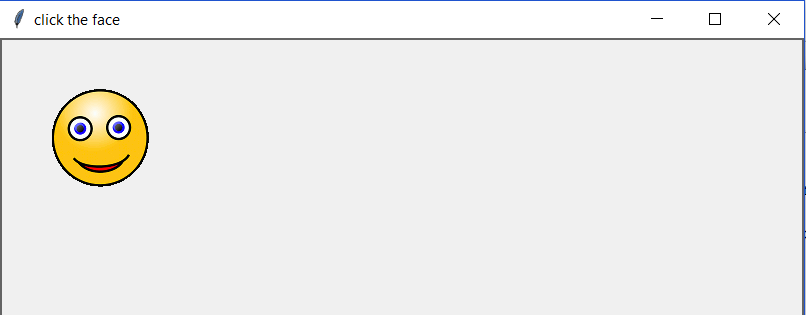
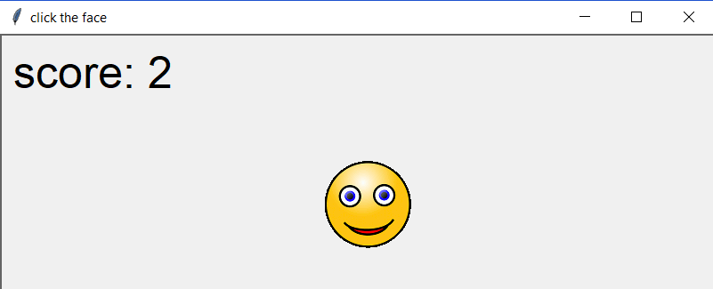

# CoderDojo Tutorial: Click the face

## Introduction
This is a very simple game, based upon Game Makers 'click the clown' game which was could be built in one hour with GameMaker.

In this game is a single moving object (a face), which bounces around the screen. Each time you click it: you get a point of score, the object teleports to a new location and starts moving a bit faster. There is no win/lose condition, its just a fun little thing.

## 1. Minimal setup

Create a python file in the my_work directory and add the following code:

	# 1, Import the library
	from packages import *

	# 2, the canvas
	create_canvas('click the face')

	# 3, the face
	face = ImageSprite('my_images/face.gif')

	# 6, off we go
	mainloop()

*Note: 4 & 5 will be added in later code*

This will give:

## 2.1. Movement

To get movement we will need to do two things:
* Set the speed on the sprite to a random number
* Make the sprite move by this speed repeatedly

To do this we will need to make a few changes to the code

	# 1, Import the library
	from packages import *
	import random

	# 3, the face
	face = ImageSprite('my_images/face.gif')
	face.speed_x = random.randint(-20,20)
	face.speed_y = random.randint(-20,20)

	# 4, setup the movement functions
	def move_face():
	    face.move_with_speed()

	# 6, off we go
	forever(move_face)
	mainloop()

In section 1 we added the `import random` to get access to the random functions.
In section 3 we set the `speed_x` and `speed_y` to random numbers.

> **Tech Note:** `random.randint()`
>
> The randint function will give you a random whole number between the two values put in. So if you wanted to simulate a dice roll you could use `randint(1,6)`.
>
> In our case we are getting a random number which could be positive or negative, which allows the face to move left/right/up/down

In section 6 we added the `forever()` code which keeps calling the `move_face()` function. This function does the movement of the face.

A test of this will give up a moving face. **But** it will move off the screen never to be seen again. So we need to deal with that.

## 2.2. Movement with Bouncing

So, we need to add the bouncing routine. To do this we just need to extend the `moveFace()` function.

	# 4, setup the movement functions
	def move_face():
	    face.move_with_speed()
	    face.if_on_edge_bounce()

> **Tip:** Keep the code neat
>
> As you work, put code together into logical groups. If needed move code about from one function to another if you need to to keep it neat.

A test will show the face bouncing ok. So lets add the click code.

## 3. Adding the Click routine
This is fairly simple, we need a function which is triggered when the player clicks. We then need to move the face to a new place and speed it up.

	# 5, click hits the face
	def check_for_hit():
	    if mouse_touching(face):
	        face.move_to_random_pos()
	        face.accelerate(1.1)

	# 6, off we go
	when_button1_clicked(check_for_hit)
	forever(move_face)
	mainloop()

When the player clicks we do a simple `if` check and if required we move the face to a new position and we accelerate it (by 10%).

When you test this, the face does not get faster when we click it. It seems to get slower.  This is because there is a max-speed on sprites which we need to increase, so add this code in.

	# 3, the face
	face = ImageSprite('my_images/face.gif')
	face.speed_x = random.randint(-20,20)
	face.speed_y = random.randint(-20,20)
	face.max_speed = 100

The face will move quicker as you click it.

## 4. Scores
To do scores is fairly simple, but it needs a lot of code in different places. We need to:
* Set the initial score to zero
* Every time the player clicks they get score
* Draw the score on the screen

The code will look like this:

	# 2, the canvas
	create_canvas('click the face')
	world = Struct(score=0)	# set score to zero

	# 5, click hits the face
	def check_for_hit():
	    if mouse_touching(face):
	        face.move_to_random_pos()
	        face.accelerate(1.1)
	        world.score += 1	# add 1 to the score
	        show_variable("score",world.score)	# show the new value for score

You game is now playable, with a challenge and a score system:

## 5. Whats next?
We have our game, so how could we improve it? Here are some ideas:
* Change the graphics, give it a background
* Replace the text with something nicer
* Add some sound/music
* Have more than one face
* Decrease the score if you miss
* Have a time limit for the game
* Have lives, so you can only miss three times

Some of these will be easier than others. Pick whatever you feel like or add your own ideas.

*For those who have trouble typing it in, the full code can be found in examples/click_face.py*
