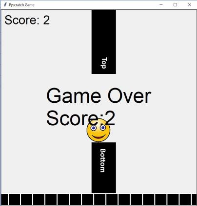
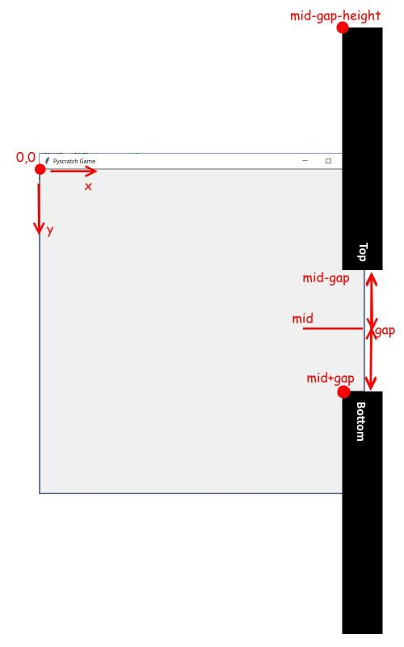

# CoderDojo Tutorial: Flappy

## Introduction
Flappy Bird is a relatively simple game.  Its a lot more complex than click the face, but its nowhere near as complex as many other games.  This version is as simple as we can make it while still having the main features of the game. Graphically it looks *super ugly* but thats ok, because you can easily replace the graphics with some nicer pictures.

**Warning:** This game is around 100 lines of code, if you have not done the 'Click the Face' and other simple tutorials, do them first before you try this one. But if you are ready for a challenge, lets go!

## 1. Minimal setup

Create a python file (flappy.py) in the my_work directory and add the following code:

	# 1, Import the library
	import sys; sys.path.append('..')
	from geekclub.pyscratch import *

	# 3, canvas and the player
	create_canvas()

	player = ImageSprite('my_images/face.gif')
	player.move_to(350,200)

	# 6, player flap and gravity
	def flap():
	    print('flap')

	def update_player():
	    pass # we will do this soon

	# 11, the main loop
	def update():
	    update_player()

	# 12, setup all the functions and the main program loop
	when_key_pressed('<space>', flap)
	forever(update)

	mainloop()

*Note: all the missing numbers will be added in later*

This will give: the screen, the player. If you hit the space key, it will print 'flap' just so we know its working. The only other thing of note is the `update` function, which calls `update_player`.

> **Tech Note:** Game loops
>
> A lot of games have the idea of a game loop. Its a single function which is called many times a second within the game to do all the work. Our game loop function (update) doesn't do much right now, but later it will: move the player, move the walls, check for collisions, move the floor and more.

## 2.1. Movement: Gravity

If you have studied Physics, you may know about velocities and acceleration. Flappy bird uses this to get interesting motion in the game. We will do the same. The summary of whats going on is:

* gravity causes a downward acceleration which pulls the player down
* pressing the flap button will give the player an upward velocity which moves them up

Enough talk, lets write some code, first for gravity:

	# 2, numbers for the game
	GRAVITY=1

	# 6, player flap and gravity
	def flap():
	    print('flap')

	def update_player():
	    # add gravity: +ve is down, so the player falls
	    player.speed_y+=GRAVITY
	    # move velocity
	    player.move_with_speed()

If you test this, you will find the player now falls out of the sky. At first its very slowly, then faster and faster. Thats the gravity taking effect.

## 2.2. Movement: Flapping

However having the player only fall is rather dull, so lets add the flap code.

	# 2, numbers for the game
	GRAVITY=1
	FLAP_POWER=10

	# 6, player flap and gravity
	def flap():
	    # flap: -ve is up, so setting the speed to -ve will make the player move up
	    player.speed_y= -FLAP_POWER

What is happening is when the player presses the flap button it sets the players speed to upwards. It then moves up for a while, but then gravity will pull it down again.

But the player is moving up and down in a good 'flappy' way.

> **Try this:**
>
> Try changing `GRAVITY` to being a different number (such as 0.5, 2, 0 or -1).
> Then try changing `FLAP_POWER` to a different number (such as 20, 5, 0 or -10).

> **Tip:** Naming of variables
>
> I like to put variables which I set once and never change in `ALL_CAPS`.
> You don't have to, but its the practice which I like to do to make them clear to me.

## 3.1. Adding walls

We need those two walls to be on the screen. I used extra ugly walls marked 'top' and 'bottom' so I was clear which was which. You can use these, but I suggest you make your own.

The dimensions for the images are 100 pixels wide by 600 pixels high

Our first task is just to add the walls in at the right place. So lets do that:

	# 2, numbers for the game
	GRAVITY=1
	FLAP_POWER=10
	world=Struct(gap=150)

	# 4, create walls
	wall_top = ImageSprite('my_images/wall_top.gif')
	wall_bottom = ImageSprite('my_images/wall_bottom.gif')
	# position them on the right & put them moving left
	# remember the position is the TOP LEFT corner of the image
	# so we use the sprites height to adject the top wall
	mid=CANVAS_HEIGHT/2
	wall_top.move_to(CANVAS_WIDTH-50,mid - world.gap - wall_top.height)
	wall_bottom.move_to(CANVAS_WIDTH-50,mid + world.gap)

The code here is a little complex as we need to consider the position of the top left corner of each of the walls. It might be a bit clearer with a picture, so lets try.

* for the bottom wall, we take the middle of the screen's height, we then move it down (thats add because down is positive) by the value `world.gap` (more on that later)
* for the top wall, again we take the middle and move it up (subtract) by the `world.gap`, but that is the bottom of the wall, we need to determine the top of the wall. So we also need to include the height of the wall.

*If this seems like its a lot of work, it is. As you work more and more on these kind of projects you will learn to understand what needs to be calculated. Sometimes you can guess and get it right, but more often when you guess it fails. So be persistent in your experimenting. It will take time to get these things right.*

## 3.2. Moving walls: part 1

Although the walls are in, we are not seeing them move at all, so lets add this in.

> **Note: Smoke and Mirrors**
>
> You might be thinking "doesn't the player fly forward and the walls stay still?"
>
> If you thought that, then the game fooled you.  Its a good trick. It looks like the player is moving forward. But in reality, the player stays still and everything else moves backwards.

So its a very simple code change to make the wall move. The code is similar to the player, but instead of making the walls accelerate, we just have a fixed speed.

	# 2, numbers for the game
	GRAVITY=1
	FLAP_POWER=10
	world=Struct(gap=150,speed=20)

	# 4, create walls
	wall_top = ImageSprite('my_images/wall_top.gif')
	wall_bottom = ImageSprite('my_images/wall_bottom.gif')
	# position them on the right & put them moving left
	# remember the position is the TOP LEFT corner of the image
	# so we use the sprites height to set the TOP image
	mid=CANVAS_HEIGHT/2
	wall_top.move_to(CANVAS_WIDTH-50,mid - world.gap - wall_top.height)
	wall_bottom.move_to(CANVAS_WIDTH-50,mid + world.gap)
	wall_top.speed_x=-world.speed
	wall_bottom.speed_x=-world.speed

	# 7, move the walls
	def update_walls():
	    wall_top.move_with_speed()
	    wall_bottom.move_with_speed()

	# 11, the main loop
	def update():
	    update_player()
	    update_walls()

So what do we have? We add a speed attribute added to the world, the walls now set their `speed_x` (its negative as we want the wall moving left), we then add a `update_walls()` function to move them

> **Tech Note: The game loop, part 2**
>
> Notice that `update()` getting more complex, it will keep getting move and more complex as this project continues. But by breaking into sub-functions, we can keep it generally quite clear.  As you projects get big, having clear code is vital.

The walls move great, only one problem: when they move of the screen they are never seen again.  In fact if you printed the position of the wall, you will realise that they just keep moving left forever.

## 3.3. Moving walls: part 2

So lets make the walls wrap around.

What we need to do is every time the walls move, we check to see if they are off the left hand side screen. If they are we move the walls to the right hand side of the screen.

	# 7, move the walls
	def update_walls():
	    wall_top.move_with_speed()
	    wall_bottom.move_with_speed()
			# if off screen move back on:
	    if wall_top.x<-50:
	        # reset the walls
	        mid=random.randint(300,500)
	        wall_top.move_to(CANVAS_WIDTH-50,mid - world.gap - wall_top.height)
	        wall_bottom.move_to(CANVAS_WIDTH-50,mid + world.gap)

The code is a simple `if` statement, watching the position of the walls. We have added an extra bit in the code, the `randint()` means that when the walls move back to the start the gap is not always in the same place.

You can run this and test it. The walls work fine, but there are always more things to add. Most noticeable is that nothing happens when you move through the walls. So that must be the next stage.

> **Note: a joke**
>
> Q: How do you eat an elephant?
>
> A: One bite at a time
>
> Q: How do you make a game?
>
> A: One feature at a time
>
> Rather than trying to build too much at once, we build a bit, test a bit, build the next bit and so on.  If a feature doesn't work, don't waste time trying to build more on a broken game. Instead get that bit working ok and them move on.

## 4.1. Gameplay: Game over

Normally we would talk about winning and losing, but there is no winning in flappy bird, you just keep playing forever. Lets add the check for collision.

	# 9, check for player hitting the walls
	def check_for_game_over():
	    if player.touching(wall_top) or player.touching(wall_bottom):
	        end_game("Game Over")

	# 11, the main loop
	def update():
	    update_player()
	    update_walls()
	    check_for_game_over()

That was surprisingly little code. The `game_over()` function just stops the game dead with no special animation or effect, just a simple message.

That was easy, but there is a bug in the game. Can you find it?

If the player goes off the top or bottom of the screen the game keeps playing. So we need to check the `y` value of the player. Either we need a very long `if` statement or we need two `if` statements, so here we go...

	# 9, check for player hitting the walls
	def check_for_game_over():
	    if player.touching(wall_top) or player.touching(wall_bottom):
	        end_game("Game Over")
	    if player.y<0 or player.y>CANVAS_HEIGHT-player.height:
	        end_game("Game Over")

## 4.2. Gameplay: Score

We haven't done the scores yet, so lets address that. The player should get one point every time they fly through the gap. But instead we are going to give score every time the walls move off the screen, because its easier.

	# 2, numbers for the game
	GRAVITY=1
	FLAP_POWER=10
	world=Struct(gap=150,speed=20,score=0)

	# 7, move the walls
	def update_walls():
	    wall_top.move_with_speed()
	    wall_bottom.move_with_speed()
	    # if off screen move back on:
	    if wall_top.x<-50:
	        # give score
	        world.score+=1
	        show_variable('Score',world.score)
	        # reset the walls
	        mid=random.randint(300,500)
	        wall_top.move_to(CANVAS_WIDTH-50,mid - world.gap - wall_top.height)
	        wall_bottom.move_to(CANVAS_WIDTH-50,mid + world.gap)

	# 12, setup all the functions and the main program loop
	show_variable('Score',world.score)

	when_key_pressed('<space>', flap)
	forever(update)

	mainloop()

Quite a few changes, but not too much overall. In section 2, we add the score attribute and then display it in section 11. The only change in section 7 is the adding to the score and displaying it again. So overall it was quite simple.

We also want to show the score at the end of the game, so lets add that too.

	# 9, check for player hitting the walls
	def check_for_game_over():
	    if player.touching(wall_top) or player.touching(wall_bottom):
	        end_game("Game Over\nScore:"+str(world.score))
	    if player.y < 0 or player.y+player.height>CANVAS_HEIGHT:
	        end_game("Game Over\nScore:"+str(world.score))

> **Tech Note: \n**
>
> The `\n` in a string means a newline. This means when it prints the game over message, 'Game Over' is on one line, and the score is on the next line. We could have left it in one piece, but its a bit long and this looks nicer.

## 4.2. Gameplay: Difficulty

If you play the game you can probably get a score of 10 or more. Its not getting any more challenging, its just getting tedious. What should happen is the player starts moving faster (well the walls actually move faster) and the gap between them should get smaller.  Lets add that, we make a new function for this and call it when the player gets score.

	# 2, numbers for the game
	GRAVITY=1
	FLAP_POWER=10
	GAP_SHRINK=5
	SPEED_INC=1
	world=Struct(gap=150,speed=20,score=0)

	# 7, move the walls
	def update_walls():
	    wall_top.move_with_speed()
	    wall_bottom.move_with_speed()
	    # if off screen move back on:
	    if wall_top.x<-50:
	        increase_difficulty()
	        # give score
	        world.score+=1
	        show_variable('Score',world.score)
	        # reset the walls
	        mid=random.randint(300,500)
	        wall_top.move_to(CANVAS_WIDTH-50,mid - world.gap - wall_top.height)
	        wall_bottom.move_to(CANVAS_WIDTH-50,mid + world.gap)

	# 8, increasing the difficulty in the game
	def increase_difficulty():
	    # make the game harder
	    world.speed+=SPEED_INC
	    wall_top.speed_x=-world.speed
	    wall_bottom.speed_x=-world.speed
	    world.gap-=GAP_SHRINK

In case you were wondering why `gap` and `speed` were in the `world` object, here is the reason. I had planned for then not to be fixed, but to change over time. I could have started with them being fixed and then changed them later, but it would have been hard work and a lot of changes. However if you find that you need to make those kind of big changes: make a backup copy of your work and make them. Its always a better idea to tidy up if you need to.

## 5. Polish

This is a massive project, I think this is about page 10 now. But we are not yet done. But the game is playable so here are a few simple changes you can make to polish this.

* Replace the images with some nicer ones
* Test the game an adjust the values until you are happy with the difficulty
 * `GRAVITY` and `FLAP_POWER`
 * The initial game speed and gap size, held in `world`
 * `SPEED_INC` and `GAP_SHRINK`
